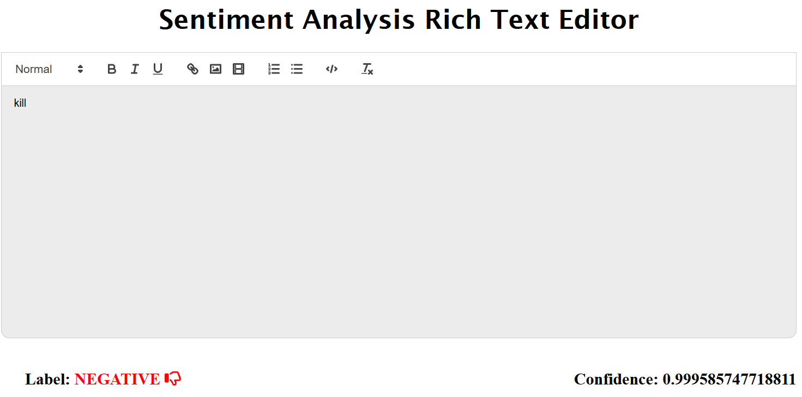

# 🧠 AI-Powered Rich Text Editor for Spam Detection

A modern **Rich Text Editor** built with **React + Vite**, integrated with **AI-based classification** to detect whether the input text is **spam or not**.

---

## 🚀 Features

- 📝 Fully functional rich text editor
- 🤖 AI model integration for real-time classification
- 🧠 Sentiment or spam detection
- 💬 Displays label (e.g., `SPAM` / `NOT SPAM` or `POSITIVE` / `NEGATIVE`)
- 🎯 Confidence score for prediction
- ⚡ Built with React + Vite for fast performance

---

## 🛠️ Tech Stack

- **Frontend**: React, Vite
- **AI/ML**: Transformers via `@xenova/transformers`
- **Editor**: Rich Text Editor (e.g., React Quill, Slate, or similar)

---

